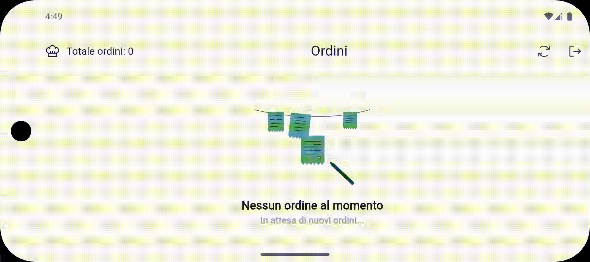
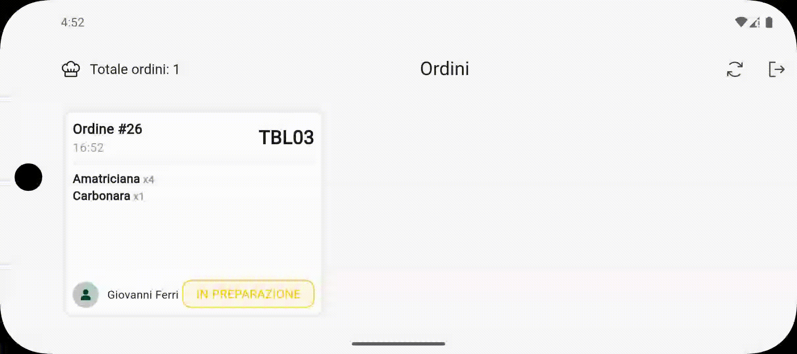

# Foody Business App

# Table of Contents
- [Description](#description)
    - [Useful Links](#useful-links)
    - [What is Foody](#what-is-foody)
    - [What is Foody Business App](#what-is-foody-business-app)
- [Use cases](#use-cases)
    - [Waiter](#waiter)
        - [Create order](#create-order)
    - [Cook](#cook)
        - [Orders](#orders)
            - [View orders](#view-orders)
            - [View order dishes](#view-order-dishes)
            - [Set as preparing](#set-as-preparing)
            - [Set as completed](#set-as-completed)
    - [Common Cases](#common-cases)
        - [Sign in](#sign-in)
        - [Logout](#logout)

# Description

## Useful Links
- Documentation: https://docs.google.com/document/d/1p1RFOiUF8x7opr-N9B8PLcPE7cJZiqI1_v2iclKKEvk/edit?usp=sharing
- Presentation: https://pitch.com/v/presentazione-foody-hk9puv

## What is Foody
Foody is an **innovative** and **centralized** software solution designed to optimize interactions between **users** and **restaurants**. It offers an all-in-one platform for **table reservations**, **in-restaurant orders**, **payments** and **reviews** through a user-friendly interface.

The system includes a mobile app for customers to find restaurants, book tables, place orders, make payments and leave reviews, as well as a dedicated app for restaurant owners to **manage menus**, **reservations**, and **customer feedback**. Additionally, it supports restaurant staff by **streamlining order management** and communication between the kitchen and dining area, improving efficiency and service accuracy.

Foody addresses the growing need for digitalization in the restaurant industry, providing a **scalable** and **innovative** solution to enhance both customer experience and operational performance.

## What is Foody Business App
Foody Business App is the **dedicated** mobile application **for waiters and chefs**, designed to streamline order management and enhance restaurant operations. With Foody, waiters and chefs can:

- **Take orders** directly from the table and send them to the kitchen in real-time
- **Receive and manage orders** efficiently with live updates
- **Track order statuses** to ensure smooth and timely service
- **Optimize workflow** and **reduce errors** with an intuitive interface
- ...and much more!

With its real-time synchronization and user-friendly design, Foody Business App helps restaurants operate more efficiently, ensuring a smooth and professional dining experience.

# Use Cases

## Waiter

### Create order

## Cook

### Sign in

### Orders

#### View orders

#### View order dishes

#### Set as preparing

#### Set as completed

## Common Cases

### Sign in

### Logout

